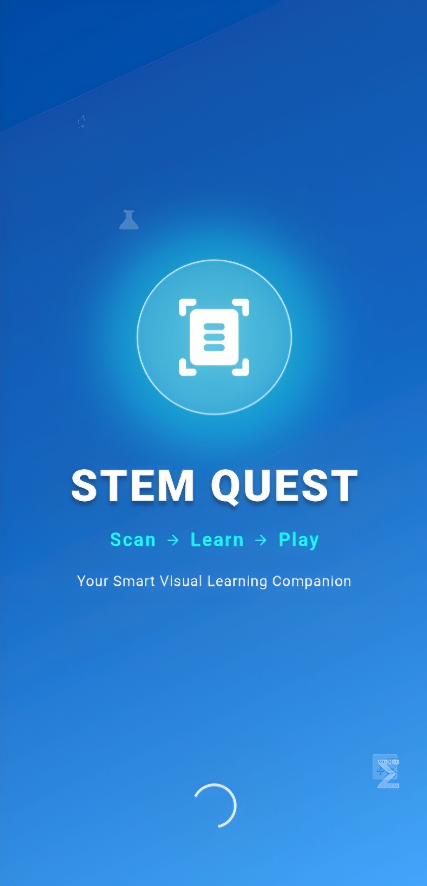
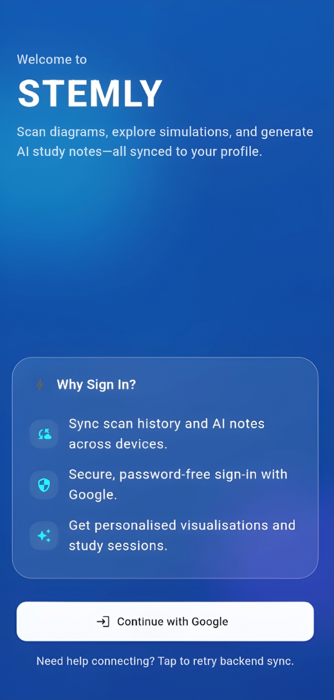
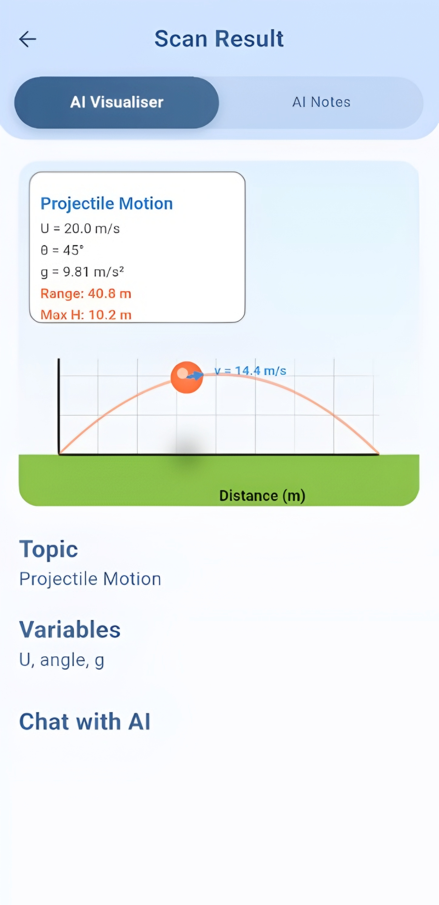
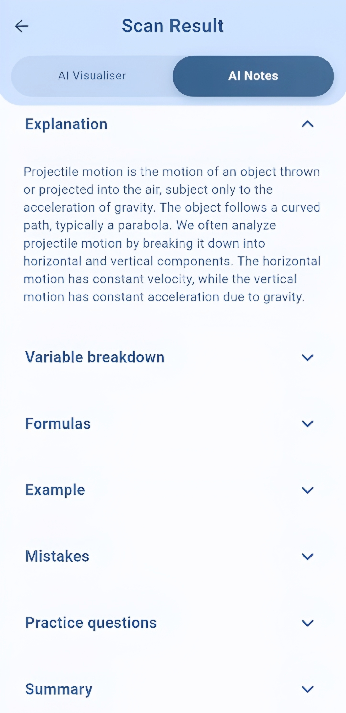
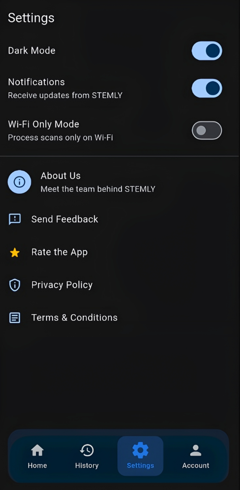

# Stemly 🚀

**Scan → Analyze → Visualize → Study**

An AI-powered STEM learning platform that transforms diagrams and problems into interactive simulations and comprehensive study notes.

[](https://github.com/SH-Nihil-Mukkesh-25/Stemly)
[](https://flutter.dev)
[](https://fastapi.tiangolo.com)

---

## 🌟 What is Stemly?

Stemly is an advanced educational application that bridges the gap between theoretical STEM concepts and visual understanding. By combining real-time computer vision, generative AI, and interactive physics simulations, we've created a unique **"Text-to-Simulation"** learning experience.

**The Problem:** Students struggle to visualize abstract physics concepts from textbooks and static diagrams. Traditional learning tools offer either theory OR visuals, but rarely both in an interactive, personalized way.

**Our Solution:** Scan any physics problem, and Stemly instantly generates:

- **AI Visualiser**: Dynamic, parameter-driven simulations with real-time interactive controls *(Currently Physics - expanding to Math & Chemistry)*
- **AI Notes**: Comprehensive study companion with explanations, formulas, and curated resources *(Available for all STEM subjects)*

This creates a complete learning ecosystem where students can both SEE the physics in action and UNDERSTAND the underlying theory.

---

## 📸 App Screenshots

<div align="center">

### Welcome & Authentication
 

### Main Interface
  

### Settings


</div>

---

## ✨ Core Innovation

### 🎨 AI Visualiser - The Heart of Stemly

Unlike pre-recorded videos or static animations, our visualizer is a **real-time physics engine** powered by Flutter's CustomPainter:

- **Template-based simulations** - Mathematically accurate calculations (not animations)
- **Interactive parameter control** - Adjust velocity, angle, gravity, resistance with sliders
- **AI-powered regeneration** - Modify simulations using natural language
- **Real-time rendering** - 60 FPS with frame-accurate physics calculations
- **Dynamic graphs** - Auto-updating velocity-time, position-time plots

**Currently Supported Physics Simulations:**
- Projectile Motion
- Simple Harmonic Motion (SHM)
- Optics (Refraction, Reflection)
- 1D Kinematics
- Circuits (Ohm's Law)
- Wave Motion

**Natural Language Control:**
Users can ask: *"What happens if gravity increases to 15 m/s²?"* or *"Show horizontal and vertical components separately"* - and the simulation updates instantly.

### 📚 AI Notes - Complete Study Companion

Generated specifically for each scanned problem:

- **Concept Explanation** - Tailored to the exact topic scanned
- **Variable Breakdown** - Understanding each parameter
- **Key Formulas** - With physical meaning and derivations
- **Worked Examples** - Step-by-step solutions
- **Common Mistakes** - What to avoid
- **Practice Questions** - Test understanding
- **5-Point Summary** - Quick revision
- **Curated Resources** - Best videos and articles

---

## 🔄 Complete Workflow

### Step 1: Scan
Users capture any STEM content with their camera:
- Physics diagrams (projectile motion, circuits, optics)
- Math problems
- Handwritten homework
- Laboratory experiment setups

**Powered by Google Gemini Vision API** for accurate OCR and diagram recognition.

### Step 2: AI Analysis
The system immediately:
- Identifies main topic and sub-topics
- Extracts key variables (velocity, angle, acceleration, etc.)
- Determines the optimal simulation template
- Analyzes the question context

### Step 3: Dual Learning Modes

**Tab 1 - AI Visualiser** (opens by default)
- Real-time physics simulation renders instantly
- Interactive sliders for all parameters
- Live equations update with current values
- Graph visualization (v-t, s-t, a-t plots)
- Labeled components for clarity

**Tab 2 - AI Notes**
- Comprehensive theoretical explanation
- All formulas with meanings
- Solved examples
- External learning resources
- Quick summary for revision

### Step 4: Interactive Exploration
Below the visualizer is an AI chat interface where users can:
- Ask "what-if" questions
- Request parameter modifications
- Get explanations for specific phenomena
- Explore edge cases

**Example:**
```
User: "Show what happens if acceleration becomes zero after 4 seconds"
AI: [Updates simulation to show constant velocity motion after t=4s]
```

This creates an **infinite learning sandbox** for experimentation.

---

## 🏗️ Technical Architecture

### System Design

```
┌─────────────────┐
│   Mobile App    │
│   (Flutter)     │
└────────┬────────┘
         │ REST API
         ▼
┌─────────────────────────────────┐
│   FastAPI Backend               │
│   - API Routers                 │
│   - LangChain Orchestration     │
└────┬────────┬──────────┬────────┘
     │        │          │
     ▼        ▼          ▼
┌────────┐ ┌──────┐ ┌──────────┐
│Firebase│ │MongoDB│ │ Gemini  │
│  Auth  │ │       │ │   AI    │
└────────┘ └──────┘ └──────────┘
```

### Technology Stack

**Frontend (Mobile)**
- **Framework:** Flutter 3.x with Dart
- **Visualization Engine:** CustomPainter for real-time physics rendering
- **State Management:** Provider pattern
- **UI/UX:** Material Design 3 with glassmorphism
- **Camera Integration:** image_picker for scanning

**Backend (Server)**
- **Framework:** FastAPI (Python 3.10+)
- **Server:** Uvicorn ASGI for high concurrency
- **Validation:** Pydantic for type-safe data models
- **Async Operations:** Full async/await support

**AI & Machine Learning**
- **Model:** Google Gemini 1.5 Flash
  - Selected for optimal balance of speed, accuracy, and reasoning
  - Handles OCR, concept extraction, and parameter generation
- **Orchestration:** LangChain for AI workflow management
- **Prompt Engineering:** Custom templates for:
  - Tutor Mode (educational content)
  - Simulation Controller (parameter adjustments)

**Database & Auth**
- **Database:** MongoDB (NoSQL for flexible JSON structures)
- **Authentication:** Firebase Auth with Google Sign-In
- **Storage:** Scan history, user preferences, learning progress

### Key Technical Innovations

1. **Physics Rendering Engine**
   - Not video playback - actual mathematical calculations
   - Physics formulas (e.g., `y = v₀*sin(θ)*t - 0.5*g*t²`) computed per frame
   - 60 FPS performance with accurate trajectory rendering

2. **AI Simulation Controller**
   - Natural language → Parameter mapping
   - LangChain + Gemini processes user requests
   - Returns JSON diff with updated parameters
   - Frontend applies changes seamlessly

3. **Template System**
   - Modular simulation templates
   - AI selects appropriate template based on topic
   - Easily extensible for new topics

---

## 🎯 Impact & Value Proposition

**For Students:**
- Instant visual understanding of complex concepts
- Interactive exploration encourages deeper learning
- Personalized explanations adapt to their questions
- Complete study resources in one place


**Market Differentiation:**
- No existing tool combines AI-powered scanning + interactive simulations + comprehensive notes
- Goes beyond static visualizations (PhET) by offering AI customization
- More visual than text-based AI tutors (ChatGPT)

---

## 📊 Current Development Status

### ✅ Completed Features
- ✓ Core image scanning and OCR with Gemini Vision
- ✓ Physics visualizer engine with 6+ simulation templates
- ✓ AI Notes generation for all STEM subjects
- ✓ Complete FastAPI backend with authentication
- ✓ Firebase + Google authentication integration
- ✓ MongoDB database with user data persistence
- ✓ Mobile UI with glassmorphism design
- ✓ Real-time parameter controls
- ✓ Natural language simulation updates

### 🚧 Currently Working On
- AI Chat Feature - Enhanced conversational interface
- Additional Physics Templates - Expanding coverage
- Bug Fixes & Performance - Cross-device optimization
- UI/UX Polish - Improved accessibility

> **Current Scope:** Interactive visualizations are live for Physics. AI Notes work for all STEM subjects. We're actively developing visualization capabilities for Mathematics and Chemistry.

---

## 🚀 Getting Started

### Prerequisites
- Flutter SDK 3.x+
- Python 3.10+
- Firebase account
- MongoDB Atlas account
- Google Gemini API key

### Installation

```bash
# Clone repository
git clone https://github.com/SH-Nihil-Mukkesh-25/Stemly.git
cd Stemly

# Backend setup
cd backend
pip install -r requirements.txt

# Configure environment variables (.env)
MONGO_URI=your_mongodb_connection_string
GEMINI_API_KEY=your_gemini_api_key
FIREBASE_CREDENTIALS_FILE=path/to/service-account.json

# Run backend
uvicorn main:app --reload

# Flutter setup (new terminal)
cd stemly_app
flutter pub get
flutterfire configure
flutter run
```

### API Endpoints

| Endpoint | Method | Description |
|----------|--------|-------------|
| `/scan/upload` | POST | Upload image, returns identified topic and parameters |
| `/visualiser/generate` | POST | Generate initial simulation configuration |
| `/visualiser/update` | POST | Update simulation based on natural language request |
| `/notes/generate` | POST | Generate comprehensive study notes |
| `/auth/me` | GET | Get authenticated user profile |
| `/history/scans` | GET | Retrieve user's scan history |

---

## 👥 Team: Mugiwara Coders

We're a team of passionate computer science students from Coimbatore who believe in using technology to make education more accessible and engaging.

- **[SH Nihil Mukkesh](https://github.com/SH-Nihil-Mukkesh-25)** - CB.SC.U4CSE24531
   - Backend & AI
 
- **[P Dakshin Raj](https://github.com/Dakshin10)** - CB.SC.U4CSE24534
  - Frontend & Flutter
  
- **[SHRE RAAM P J](https://github.com/SHRE-RAAM-P-J)** - CB.SC.U4CSE24548
  
- **[Vibin Ragav S](https://github.com/VibinR-code)** - CB.SC.U4CSE24556

---

## 🎓 Why Stemly Stands Out

**Technical Excellence:**
- Full-stack implementation with modern technologies
- Real-time physics calculations, not pre-recorded content
- AI-powered natural language control
- Scalable architecture ready for expansion

**Educational Impact:**
- Addresses real learning challenges in STEM education
- Combines visualization + theory for complete understanding
- Personalized, interactive learning experience
- Accessible to students regardless of resources

**Innovation:**
- Unique "Text-to-Simulation" concept
- First platform to combine scanning + AI simulations + study notes
- Extensible framework for multi-subject expansion

**Execution:**
- Fully functional MVP with real users
- Clean, intuitive interface
- Robust backend infrastructure
- Clear roadmap for growth

---

## 📧 Contact & Links

**LinkedIn:** [SH Nihil Mukkesh](https://www.linkedin.com/in/sh-nihil-mukkesh/)  
**Repository:** [github.com/SH-Nihil-Mukkesh-25/Stemly](https://github.com/SH-Nihil-Mukkesh-25/Stemly)  
**Demo Video:** [Coming Soon]

---

<div align="center">

**Transforming STEM education, one scan at a time.** 🚀

*Built with ❤️ by Team Mugiwara Coders*

</div>
